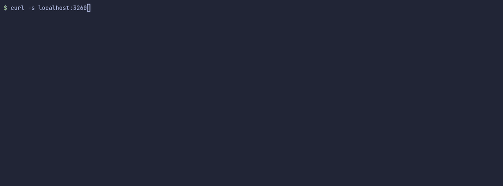
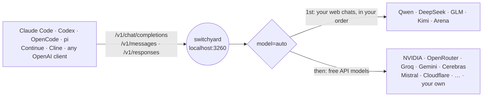
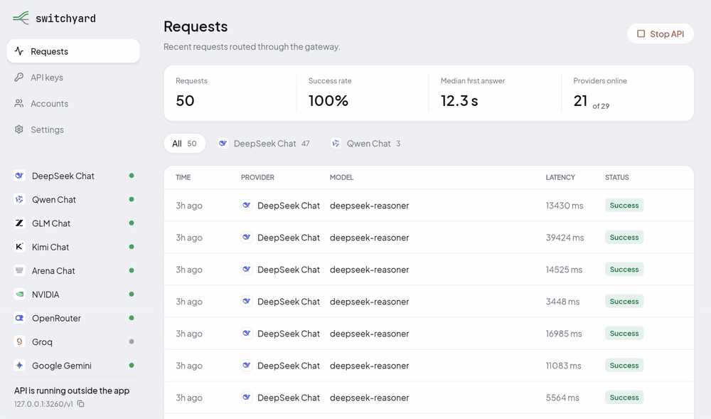
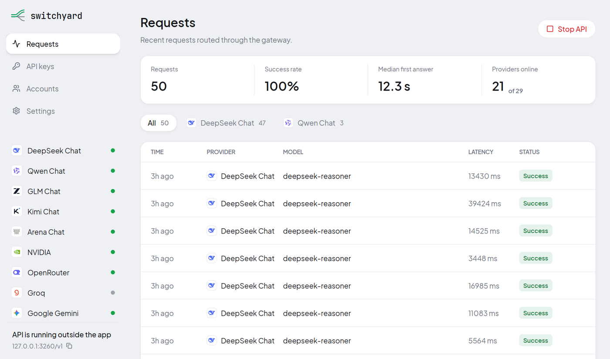
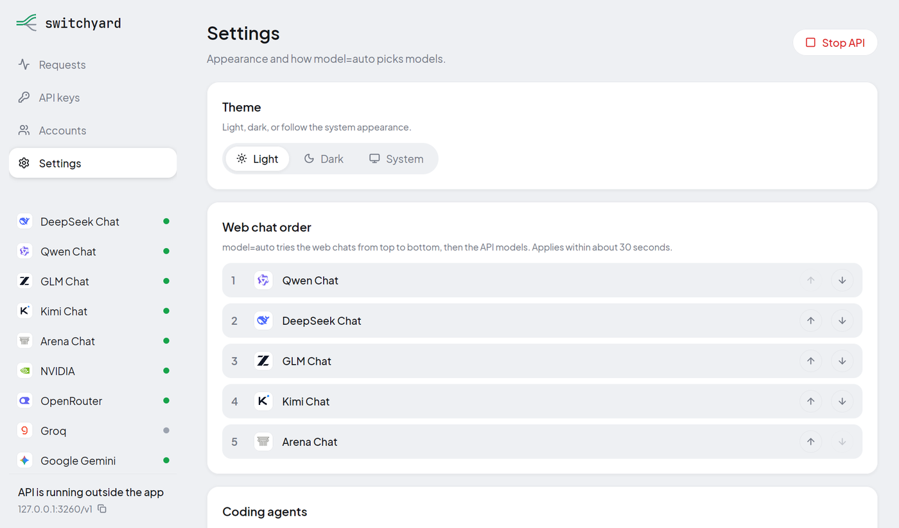
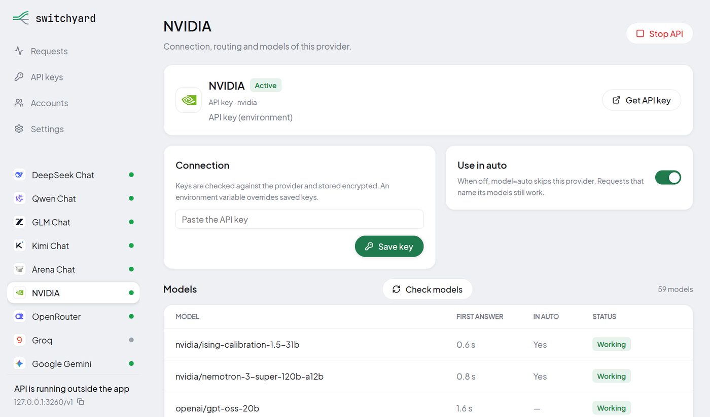
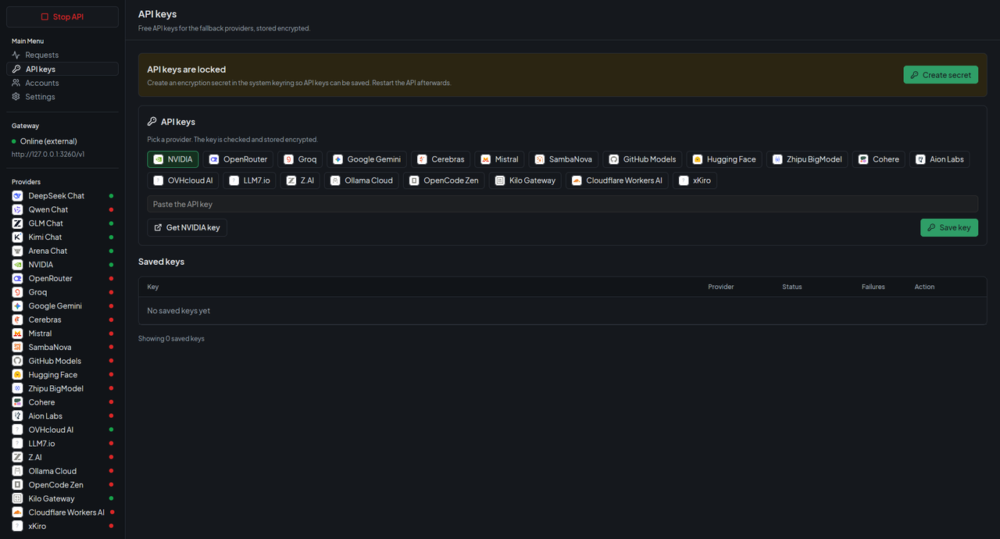
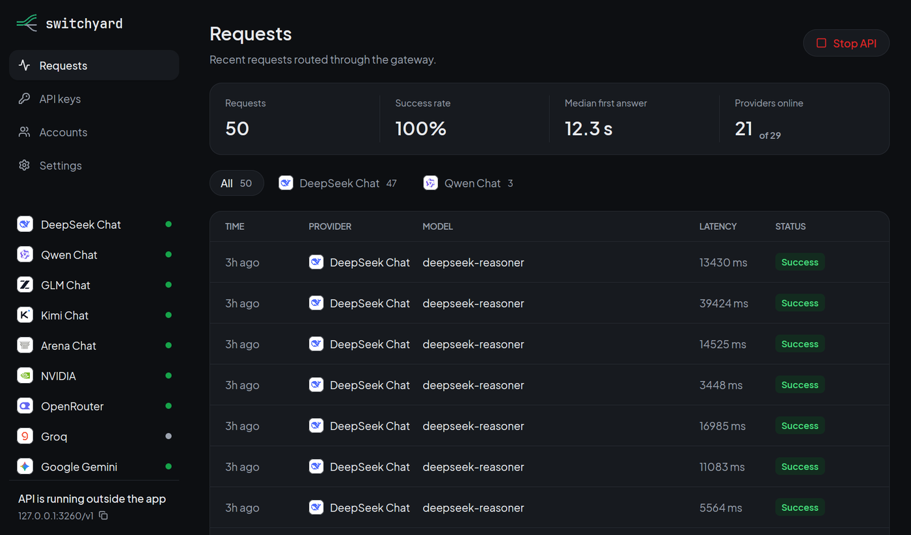
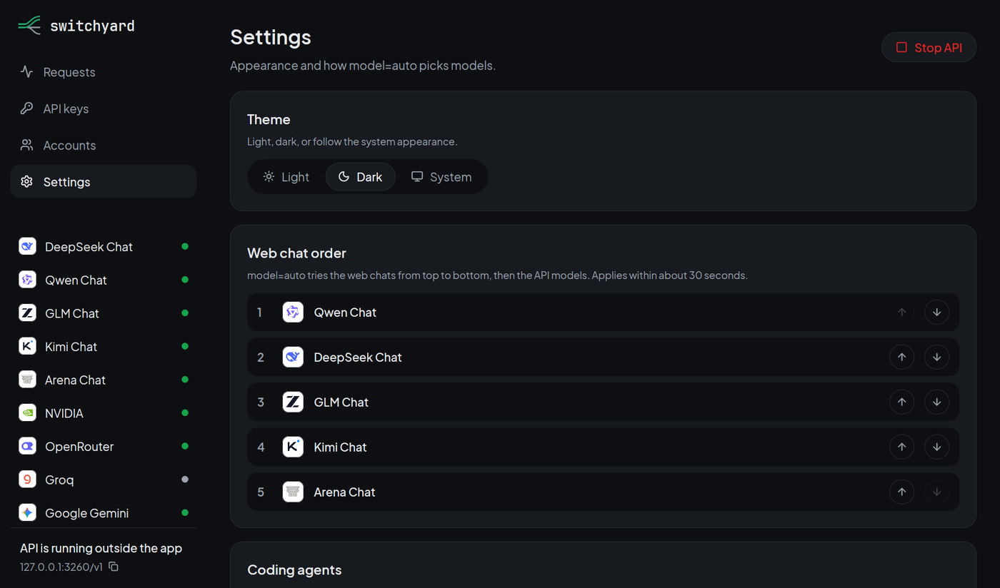
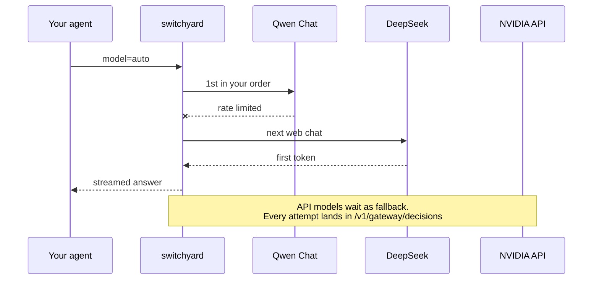

<div align="center">

<picture>
  <source media="(prefers-color-scheme: dark)" srcset="docs/images/logo-dark.png">
  
</picture>

**A local LLM gateway for coding agents.**<br>
One OpenAI- and Anthropic-compatible endpoint in front of your signed-in web chats and 25+ free model APIs, with fallback routing, native tool calling and token savings for Claude Code, Codex, OpenCode and pi.

[](https://github.com/kravchenski/switchyard/actions/workflows/ci.yml)
[](https://github.com/kravchenski/switchyard/releases)
[](https://bun.sh)
[](#api)
[](LICENSE)

[Quick start](#quick-start) · [Agents](#use-it-with-your-agent) · [Desktop app](#desktop-app) · [Providers](#providers) · [Routing](#routing) · [API](#api)



*One request to `model=auto`: the router tries the web chats in your order and logs every attempt.* [Watch as MP4](docs/images/demo.mp4)

</div>

## How it works



- **One endpoint, many models.** Point any agent at `http://localhost:3260` and ask for `model=auto`. Switchyard picks a working model and moves to the next one when a provider is down, rate-limited or out of quota.
- **Built for coding agents.** Tool calls go natively to providers that support them and are emulated for the rest, with repair of broken JSON and vendor markup, so agents keep working whichever model answers.
- **Fewer tokens.** Tool output is compacted, unneeded tools are dropped per task, and shell commands can run through [rtk](https://github.com/rtk-ai/rtk). On one bug-fix task the agent's input went from about 69k to about 7k tokens with the same result ([how it was measured](#coding-agent-optimizations)).
- **Your providers too.** Add any OpenAI-compatible API, such as Ollama, LM Studio, vLLM or a company proxy, next to the built-in ones.
- **Images both ways.** Send screenshots to vision models, or generate images through an OpenAI-compatible Images API.
- **Desktop app.** Start the gateway, add keys and accounts, set the routing order and watch every request. Installers for Linux, macOS and Windows.

## Quick start

```bash
git clone https://github.com/kravchenski/switchyard.git
cd switchyard
bun install
bun run start          # http://localhost:3260
```

Add a free key or sign in to a web chat ([Providers](#providers)), then:

```bash
curl http://localhost:3260/v1/chat/completions \
  -H "Content-Type: application/json" \
  -d '{"model": "auto", "messages": [{"role": "user", "content": "Hello!"}]}'
```

`bun run account` lists every provider, whether it is connected and the command that connects it. Prefer a window? Grab the [desktop app](#desktop-app).

## Use it with your agent

| Agent | Setup |
|---|---|
| **Claude Code** | `ANTHROPIC_BASE_URL=http://localhost:3260 ANTHROPIC_AUTH_TOKEN=<GATEWAY_API_KEY or any text> ANTHROPIC_MODEL=auto claude` |
| **OpenCode, pi, Continue, Hermes, Aider, Cline** | `bun run setup:agents` writes their configs ([details](docs/AGENT_INTEGRATIONS.md)) |
| **Codex** | OpenAI Responses API at `http://localhost:3260/v1/responses` |
| **Anything OpenAI-compatible** | base URL `http://localhost:3260/v1`, model `auto` or any id from `/v1/models` |

A bearer token is only required when `GATEWAY_API_KEY` is set.

## Desktop app

A native app (Rust + [GPUI](https://www.gpui.rs)) for everything the CLI does: start and stop the gateway, add API keys, custom providers and browser accounts, order the web chats, switch providers in or out of `auto`, and watch requests and model health. Click a request to see how it was routed: which models were skipped and why, each attempt with its error and time, and who answered. When a web chat loses its sign-in, a banner says so and takes you to its sign-in. Click the address in the sidebar to copy the base URL.

<p align="center">
  <picture>
    <source media="(prefers-color-scheme: dark)" srcset="docs/images/tour-dark.gif">
    
  </picture>
  <br>
  <em>Full quality: <a href="docs/images/tour-light.mp4">light</a> · <a href="docs/images/tour-dark.mp4">dark</a></em>
</p>

Installers for Linux (`.deb`), macOS (`.dmg`) and Windows (`.exe`) are attached to every [release](https://github.com/kravchenski/switchyard/releases). They bundle the gateway, so Bun is not needed; Chrome or Chromium is needed for the web chats. The installers are not code-signed yet.

<details>
<summary><b>Screenshots</b></summary>
<br>

<table>
  <tr>
    <th>Requests and health</th>
    <th>Web chat order and agent options</th>
  </tr>
  <tr>
    <td></td>
    <td></td>
  </tr>
  <tr>
    <th>Models a key can use</th>
    <th>API keys and custom providers</th>
  </tr>
  <tr>
    <td></td>
    <td></td>
  </tr>
  <tr>
    <th>Dark theme</th>
    <th>Dark theme</th>
  </tr>
  <tr>
    <td></td>
    <td></td>
  </tr>
</table>

</details>

## Providers

Everything below has a free tier or works through your own signed-in web account.

| Provider | Connect with |
|---|---|
| **Qwen, DeepSeek, GLM, Kimi, Arena** (web chats) | your browser account: `bun run account open <url>`, `bun run account token <site>`, or `bun run auth:deepseek` |
| **NVIDIA** | `NVIDIA_API_KEY` |
| **OpenRouter, Groq, Gemini, Cerebras, Mistral, SambaNova** | `<PROVIDER>_API_KEY` |
| **Cloudflare Workers AI** | `CLOUDFLARE_API_KEY` + `CLOUDFLARE_ACCOUNT_ID` |
| **15 more** | see the full list below |
| **Your own** | `bun run account custom add <id> --url <base-url>` |

<details>
<summary><b>Full provider list</b></summary>
<br>

| Provider | Models | How to connect |
|---|---|---|
| **DeepSeek** (web) | `deepseek-default`, `deepseek-reasoner`, `deepseek-expert`, `deepseek-search`; takes images | `bun run auth:deepseek`, or `bun run auth:deepseek -- --token` with the `userToken` from your own browser when the sign-in window keeps rejecting the captcha |
| **Qwen, GLM, Kimi, Arena** (web) | `qwen-chat`, `glm-chat`, `kimi-chat`, `arena-chat` and every model those sites offer, e.g. `glm-chat/glm-5.3`, `kimi-chat/k3`, `arena-chat/claude-sonnet-4-6`; take images | your signed-in browser: `bun run account open <url>`, or `bun run account token <site>` (`qwen-chat`, `glm-chat`, `kimi-chat`) with the token from your own browser |
| **NVIDIA** | every chat model your key can use (`nvidia/*`, `deepseek-ai/*`, `moonshotai/*`, `meta/*`, …) | `NVIDIA_API_KEY` |
| **OpenRouter** | free models, `openrouter/<model>:free` | `OPENROUTER_API_KEY` |
| **Groq, Gemini, Cerebras, Mistral, SambaNova** | free-tier chat models, `groq/<model>`, `gemini/<model>`, … | `<PROVIDER>_API_KEY` |
| **GitHub Models, Hugging Face, Zhipu BigModel, Cohere, Aion Labs, LLM7.io** | free-tier models under their prefix | `<PROVIDER>_API_KEY` |
| **Z.AI, Ollama Cloud, OpenCode Zen** | free flash GLM, Ollama Cloud models, free Zen models | `<PROVIDER>_API_KEY` |
| **Cloudflare Workers AI** | `cloudflare/@cf/<model>`, 10,000 free neurons a day | `CLOUDFLARE_API_KEY` + `CLOUDFLARE_ACCOUNT_ID` |
| **Kilo Gateway, OVHcloud AI Endpoints** | free models; work even without a key | optional key |
| **AIHubMix, AshnaAI, NaraRouter** | `aihubmix/<model>-free`, `ashna/<model>`, `nararouter/<model>`; AshnaAI and NaraRouter are off in `auto` until enabled, and AshnaAI's API needs a paid plan | `<PROVIDER>_API_KEY` |
| **Token Harbor** | free models only, `tokenharbor/<model>:free` | `TOKENHARBOR_API_KEY` |
| **xKiro** | third-party gateway, free models only, off in `auto` until enabled | `XKIRO_API_KEY` |
| **Custom** | `<id>/<model>` for any OpenAI-compatible API | `bun run account custom add <id> --url <base-url> [--name <name>]` |

</details>

<details>
<summary><b>Keys, accounts and custom providers</b></summary>
<br>

- Keys go in `.env` (see `.env.example`) or are saved encrypted with `bun run account add <provider> --api-key` or the desktop app.
- **Several keys per provider:** `GROQ_API_KEY=k1,k2,k3` or `["k1","k2"]`. Switchyard sticks to the key that works and switches to the next one in the same request when a key is rate-limited, out of quota or rejected.
- **Several web accounts:** each is its own browser profile, and requests rotate between the signed-in ones (`bun run account profile add`, `connect`, `status`).
- **Gentle on web accounts:** each account keeps requests in one chat (a request with its own `conversation_id` gets its own chat), sends one message at a time and waits `WEB_CHAT_MIN_INTERVAL_MS` (10 s) between messages. Heavy automated traffic still breaks the sites' terms and can get an account blocked; use API providers for bots.
- **Collect keys from an account:** `bun run account auto-collect --profile <id>` signs in to the web chats and provider dashboards with that account's Google session and creates its API keys (Auto-collect keys on the desktop Accounts page). Stop the API first, because it uses the same browser profile.
- **Custom providers:** `bun run account custom add <id> --url <base-url> [--name <name>]`, or the Custom provider card on the desktop API keys page. Save a key with `bun run account add <id> --api-key` if it needs one. Models are named `<id>/<model>` and join `auto` as a fallback. Use `https://`, or `http://` only for localhost.
- Models a key cannot use are detected and hidden; `bun run models:probe` measures which models answer and how fast.

</details>

## Routing

Ask for `auto` and Switchyard builds the chain from what the request carries:

| The request has | Chain |
|---|---|
| text | one model per web chat in your order, then the best measured API models |
| images | Qwen Chat first, then the other web chats in your order, then API models that can see images |
| tools | the web chats in your order, then strong API models with native tool calling |
| images and tools | the image chain; tools are passed natively wherever the model supports them |

`agent` and `vision` still work as names for `auto`, so existing agent configs keep running.



Set the order of the web chats on the desktop Settings page or with `bun run account auto --order qwen-chat,deepseek,glm-chat,kimi-chat,arena-chat`; chats you leave out keep their default place after the ones you list. Each web chat uses its fastest measured model unless you pick one: click the chat in Settings, or run `bun run account auto --model qwen-chat=qwen-chat/qwen3.8-max` (`=fastest` goes back). If the picked model is unavailable, the chat falls back to its fastest one. A provider can be taken out of `auto` on its page in the app or with `bun run account provider <id> --auto off`.

The chains are listed in `GET /v1/gateway/status` (`autoModels`, `visionModels`, `agentModels`), and every decision (skipped candidates and why, each attempt, latency, the pick) is at `GET /v1/gateway/decisions`.

## Coding agent optimizations

For requests that carry tools. Switch each one on the desktop Settings page or with `bun run account auto --<option> on|off`:

| Option | Default | What it does |
|---|---|---|
| `--compact` | on | Trims tool output the agent sends back: colours, progress bars, repeated and near-identical lines go; long output keeps its start, end and every error or warning. |
| `--tools` | on | With more than 15 tools, keeps only the ones the task needs (core and already used tools always stay). |
| `--rtk` | on | Runs the agent's shell commands through the installed [rtk](https://github.com/rtk-ai/rtk) (`git status` → `rtk git status`) while the model keeps seeing its own commands. |

<details>
<summary><b>How the 69k → 7k tokens was measured</b></summary>
<br>

The same agent (pi, nemotron-3-super) fixed the same bug: a discount rate broken by one commit in a 22-commit history, with a test suite that prints 16 KB of debug logs. Summing the context sent to the model over the whole task gave **about 69k tokens with the options off and about 7k with them on**; both runs fixed the bug. It is one task on one model, so treat it as an illustration, not a guarantee.

The headers `x-gateway-compacted`, `x-gateway-tools` and `x-gateway-rtk` show what was saved on each request.

</details>

### Jev tools on your free models

[jevgrep](https://github.com/dzhng/jevgrep) and [fast-jev-compaction](https://github.com/tamaratran/fast-jev-compaction) ask TypeSafe's Jev model small yes/no and choice questions. Switchyard answers the same requests at `/v1/systemone` with your free models, so both run without a TypeSafe key.

| Tool | What it saves | Point it at Switchyard |
|---|---|---|
| **[rtk](https://github.com/rtk-ai/rtk)** | compacts shell output before the agent reads it | install it; `--rtk` (on by default) does the rest |
| **[jevgrep](https://github.com/dzhng/jevgrep)** | the agent finds code by asking what it does instead of reading whole folders | `jg auth` → Custom endpoint, base URL `http://localhost:3260/v1`, model `auto`; then `jg skill` in your project |
| **[fast-jev-compaction](https://github.com/tamaratran/fast-jev-compaction)** | drops tool calls and results the conversation no longer needs, keeps the rest verbatim | library: `compactMessages(transcript, { baseUrl: 'http://localhost:3260/v1/systemone', apiKey: 'local' })`; its CLI scripts: `JEV_BASE_URL=http://localhost:3260/v1/systemone`. Its Claude Code plugin always calls TypeSafe |

Each Jev question costs one request to a fast API model, so the savings pay off on long agent sessions rather than short chats.

## Images

**Vision.** Put images in a message (OpenAI `image_url` parts, data URLs or links) and send it to a model that can see. The web chats attach them through each site's own upload, DeepSeek through its file upload, and vision-capable API models get them directly.

**Generation.** `POST /v1/images/generations` (OpenAI Images API) with `qwen-chat/image` (your Qwen Chat, up to 2688×1536), `cloudflare/@cf/<model>` (FLUX, SDXL) or `pollinations/<model>` (no key, watermarked). Without a `model` the first available one is used.

## API

| Method | Endpoint | Description |
|---|---|---|
| `POST` | `/v1/chat/completions` | OpenAI Chat Completions, streaming and tools |
| `POST` | `/v1/messages` | Anthropic Messages |
| `POST` | `/v1/responses` | OpenAI Responses |
| `GET` | `/v1/models` | All available models, `auto` first |
| `POST` | `/v1/images/generations` · `GET /v1/images/models` | Image generation |

<details>
<summary><b>Gateway and operations endpoints</b></summary>
<br>

| Method | Endpoint | Description |
|---|---|---|
| `POST` | `/v1/decisions` (also `/v1/systemone`) | Decision API in TypeSafe's System One shape: `choice` / `noul` / `boolean` questions answered with probabilities |
| `GET` | `/v1/gateway/decisions` | Recent routing decisions |
| `GET` | `/v1/gateway/decisions/:id` | One routing decision; request logs carry its `decisionId` |
| `GET` | `/v1/gateway/status` | Providers, accounts, models, chains, web chat order, recent requests |
| `POST` | `/v1/gateway/refresh` | Reload saved keys, custom providers and model lists |
| `POST` | `/v1/gateway/providers/:id/check` | Check which models a provider key can use |
| `GET` | `/metrics` | Prometheus metrics |
| `GET` | `/health` | Liveness |

DeepSeek also runs as a standalone OpenAI-compatible service: `bun run start:deepseek` serves `/api/v1/models` and `/api/v1/chat/completions` on port 3265 and describes them in an OpenAPI 3.1 spec at `/api/openapi.json`.

</details>

<details>
<summary><b>Configuration</b></summary>
<br>

| Variable | Default | Description |
|---|---|---|
| `UNIFIED_PORT` | `3260` | Server port |
| `HOST` | `0.0.0.0` | Bind address |
| `GATEWAY_API_KEY` | — | Require this bearer token on every request except `/health` |
| `<PROVIDER>_API_KEY` | — | One key or a list per provider (see `.env.example`) |
| `AUTO_MODELS` | — | Fixed `auto` chain instead of the measured one |
| `WEB_CHAT_MIN_INTERVAL_MS` | `10000` | Minimum pause between two messages to the same web chat account |
| `ACCOUNTS_SECRET` | OS keyring | Encrypts the saved keys in `session/credentials.enc`; `bun run account init` keeps it in the keyring |

</details>

<details>
<summary><b>Docker</b></summary>
<br>

```bash
docker compose up -d
```

Runs the gateway on `127.0.0.1:3260` with `.env` and the `session/`, `data/` and `logs/` folders mounted. Connect accounts on the host first.

</details>

<details>
<summary><b>Development</b></summary>
<br>

```bash
bun run dev               # watch mode
bun run ci                # build check, strict typecheck, tests
bun run desktop           # desktop app (cargo run)
bun run build:desktop     # gateway and accounts sidecars + release app in dist/
bun run package:desktop   # the same, plus the installer for this OS (deb, dmg or exe; needs cargo-packager)
```

```
src/
  unified/server.ts   gateway: routes, agent pipeline, images, decisions
  core/               router, decision engine, model stats, key pools, agent optimizations
  providers/          API provider catalog, custom providers, web chats, DeepSeek, images
  browser/            Playwright-driven browser sessions for the web chats
  cli/                accounts CLI and agent setup
desktop/              Rust + GPUI desktop app
```

Versions follow [Conventional Commits](https://www.conventionalcommits.org) via release-please; every release publishes a Docker image and the desktop installers.

</details>

## Built on

Switchyard stands on these projects:

| Project | Used for |
|---|---|
| [Bun](https://bun.sh) | runtime, test runner, SQLite |
| [Hono](https://hono.dev) | HTTP server |
| [Playwright](https://playwright.dev) | driving the signed-in web chats over CDP |
| [Zod](https://zod.dev), [ofetch](https://github.com/unjs/ofetch), [yaml](https://eemeli.org/yaml) | config validation, HTTP calls, agent configs |
| [GPUI](https://www.gpui.rs) and [gpui-component](https://github.com/longbridge/gpui-component) | the desktop app |
| [cargo-packager](https://github.com/crabnebula-dev/cargo-packager) | desktop installers |
| [rtk](https://github.com/rtk-ai/rtk) | compact shell output for agents |
| [jevgrep](https://github.com/dzhng/jevgrep), [fast-jev-compaction](https://github.com/tamaratran/fast-jev-compaction) | Jev-based code search and context pruning, served by `/v1/systemone` |
| [Lobe Icons](https://github.com/lobehub/lobe-icons), [Lucide](https://lucide.dev) | provider logos and app icons |
| [Plus Jakarta Sans](https://github.com/tokotype/PlusJakartaSans), [JetBrains Mono](https://github.com/JetBrains/JetBrainsMono) | app and logo fonts (OFL) |
| [release-please](https://github.com/googleapis/release-please) | versions and changelog |

## Responsible use

Web chat providers are used through **your own** signed-in accounts and their normal web flows. Switchyard does not bypass captchas or anti-bot checks; verifications are left to you in the browser window. Follow each service's terms, and keep in mind that requests sent through third-party providers leave your machine.

## License

MIT © 2026 kravchenski
