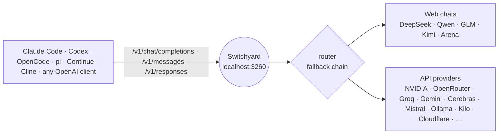
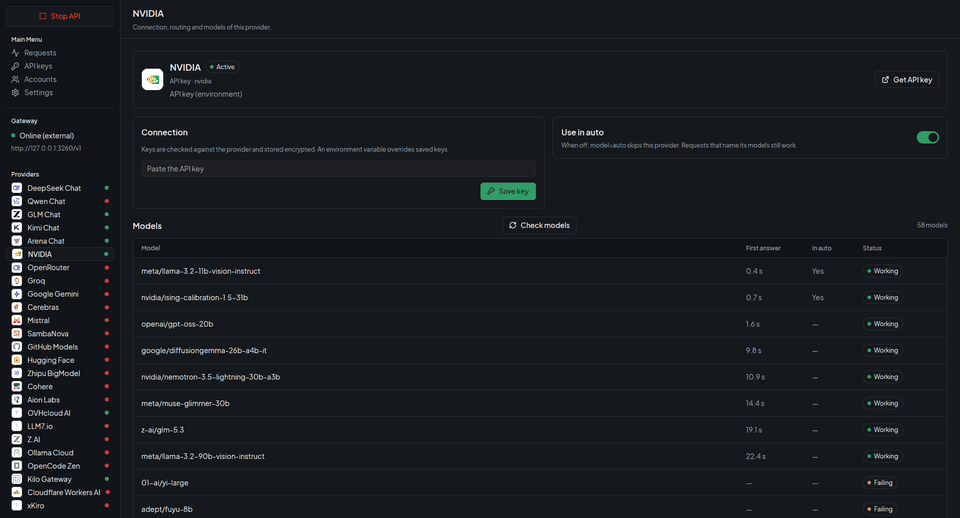
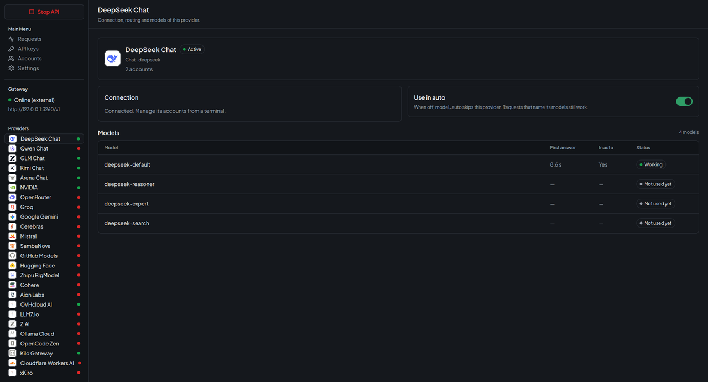

<div align="center">

# Switchyard

**A local LLM gateway for coding agents.**
One OpenAI- and Anthropic-compatible endpoint in front of 25+ model providers — with smart routing, a decision model that picks the right model for each request, native tool calling and token-saving for agents like Claude Code, Codex, OpenCode and pi.

[](https://github.com/kravchenski/switchyard/actions/workflows/ci.yml)
[](https://github.com/kravchenski/switchyard/releases)
[](https://bun.sh)
[](#api)
[](LICENSE)

[Quick start](#quick-start) · [Agents](#use-it-with-your-agent) · [Providers](#providers) · [Routing](#routing) · [Images](#images) · [API](#api) · [Desktop app](#desktop-app)


</div>



## Why

- **One endpoint, many models.** Point any agent at `http://localhost:3260` and use `model=auto` — Switchyard picks a working model, and falls back to the next one when a provider is down, rate-limited or out of quota.
- **Built for coding agents.** Tool calls are passed natively to providers that support them and emulated (with repair of broken JSON and vendor markup) for the rest, so agents keep working across models.
- **Fewer tokens.** Tool output is compacted, unneeded tools are dropped per task, and shell commands can run through [rtk](https://github.com/rtk-ai/rtk). On a benchmark bug-fix task the agent's input went from ~69k to ~7k tokens with the same result ([how it was measured](#coding-agent-optimizations)).
- **Routing that thinks.** `auto` can race several models, or ask a decision model which model fits the request — a big model for a refactor, a fast one for small talk.
- **Images both ways.** Send screenshots and charts to vision-capable models, or generate images through an OpenAI-compatible Images API.
- **Desktop app.** Manage keys, browser accounts, routing and see every request — Linux, macOS and Windows installers.

## Quick start

```bash
git clone https://github.com/kravchenski/switchyard.git
cd switchyard
bun install
bun run start          # http://localhost:3260
```

Add a few free keys (see [Providers](#providers)) or sign in to a web chat, then:

```bash
curl http://localhost:3260/v1/chat/completions \
  -H "Content-Type: application/json" \
  -d '{"model": "auto", "messages": [{"role": "user", "content": "Hello!"}]}'
```

`bun run account` shows every provider, whether it is connected and the command that connects it.

## Use it with your agent

| Agent | Setup |
|---|---|
| **Claude Code** | `ANTHROPIC_BASE_URL=http://localhost:3260 ANTHROPIC_AUTH_TOKEN=<GATEWAY_API_KEY or any text> ANTHROPIC_MODEL=agent claude` |
| **OpenCode, pi, Continue, Hermes, Aider, Cline** | `bun run setup:agents` writes their configs ([details](docs/AGENT_INTEGRATIONS.md)) |
| **Codex** | OpenAI Responses API at `http://localhost:3260/v1/responses` |
| **Anything OpenAI-compatible** | base URL `http://localhost:3260/v1`, model `auto`, `vision`, `agent` or any id from `/v1/models` |

A bearer token is only required when `GATEWAY_API_KEY` is set.

## Providers

All providers below have free tiers or work through your own signed-in web accounts.

| Provider | Models | How to connect |
|---|---|---|
| **DeepSeek** (web) | `deepseek-default`, `deepseek-reasoner`, `deepseek-expert`, `deepseek-search`; takes images | `bun run auth:deepseek`, or `bun run auth:deepseek -- --token` with the `userToken` from your own browser when the sign-in window keeps rejecting the captcha |
| **Qwen, GLM, Kimi, Arena** (web) | `qwen-chat`, `glm-chat`, `kimi-chat`, `arena-chat` and every model those sites offer, e.g. `glm-chat/glm-5.3`, `kimi-chat/k3`, `arena-chat/claude-sonnet-4-6`; take images | your signed-in browser: `bun run account open <url>`, or `bun run account token <site>` (`qwen-chat`, `glm-chat`, `kimi-chat`) with the token from your own browser |
| **NVIDIA** | every chat model your key can use (`nvidia/*`, `deepseek-ai/*`, `moonshotai/*`, `meta/*`, …) | `NVIDIA_API_KEY` |
| **OpenRouter** | free models, `openrouter/<model>:free` | `OPENROUTER_API_KEY` |
| **Groq, Gemini, Cerebras, Mistral, SambaNova** | free-tier chat models, `groq/<model>`, `gemini/<model>`, … | `<PROVIDER>_API_KEY` |
| **GitHub Models, Hugging Face, Zhipu BigModel, Cohere, Aion Labs, LLM7.io** | free-tier models under their prefix | `<PROVIDER>_API_KEY` |
| **Z.AI, Ollama Cloud, OpenCode Zen** | free flash GLM, Ollama Cloud models, free Zen models | `<PROVIDER>_API_KEY` |
| **Cloudflare Workers AI** | `cloudflare/@cf/<model>`, 10,000 free neurons a day | `CLOUDFLARE_API_KEY` + `CLOUDFLARE_ACCOUNT_ID` |
| **Kilo Gateway, OVHcloud AI Endpoints** | free models; work even without a key | optional key |
| **AIHubMix, AshnaAI, NaraRouter** | `aihubmix/<model>-free`, `ashna/<model>`, `nararouter/<model>`; AshnaAI and NaraRouter are off in `auto` until enabled, and AshnaAI's API needs a paid plan | `<PROVIDER>_API_KEY` |
| **Token Harbor** | free models only, `tokenharbor/<model>:free` | `TOKENHARBOR_API_KEY` |
| **xKiro** | third-party gateway, free models only, off in `auto` until enabled | `XKIRO_API_KEY` |

- Keys go in `.env` (see `.env.example`) or are saved encrypted with `bun run account add <provider> --api-key` / the desktop app.
- **Several keys per provider:** `GROQ_API_KEY=k1,k2,k3` or `["k1","k2"]`. Switchyard sticks to the key that works and switches to the next one in the same request when a key is rate-limited, out of quota or rejected.
- **Several web accounts:** each is its own browser profile; requests rotate between the signed-in ones (`bun run account profile add`, `connect`, `status`).
- **Gentle on web accounts:** each web chat account keeps requests in one chat (a request with its own `conversation_id` gets its own chat), sends one message at a time and waits `WEB_CHAT_MIN_INTERVAL_MS` (10 s) between messages. Heavy automated traffic still breaks the sites' terms and can get an account blocked; use API providers for bots.
- **Collect keys from an account:** `bun run account auto-collect --profile <id>` signs in to the web chats and provider dashboards with that account's Google session and creates its API keys (Auto-collect keys on the desktop Accounts page). Stop the API first, because it uses the same browser profile.
- **Custom providers:** add any OpenAI-compatible API (Ollama, LM Studio, vLLM, a company proxy) with `bun run account custom add <id> --url <base-url> [--name <name>]` or the Custom provider card on the desktop API keys page, then save its key with `bun run account add <id> --api-key` if it needs one. Its models are named `<id>/<model>` and join `auto` as a fallback. Use `https://`, or `http://` only for localhost.
- Models a key cannot use are detected and hidden; `bun run models:probe` measures which models answer and how fast.

## Routing

Three virtual models, each with its own chain built from measured latency and success:

| Model | Chain | Use it for |
|---|---|---|
| `auto` | one model per web chat, then API models | chat; a request with images switches to `vision`, one with tools to `agent` |
| `vision` | only models that can see images: the web chats and multimodal API models (`*-vision-*`, `*-VL-*`, omni, Gemini, Gemma, Pixtral, …) | screenshots, charts, photos |
| `agent` | strong API models with native tool calling first, then the `auto` chain with emulated tools | Claude Code, Codex, OpenCode, pi and other coding agents |

The chains are listed in `GET /v1/gateway/status` (`autoModels`, `visionModels`, `agentModels`). Each request tries its chain one model at a time and moves on only when a model fails. Set the order of the web chats with `bun run account auto --order qwen-chat,deepseek,glm-chat,kimi-chat,arena-chat` or on the desktop Settings page; chats you leave out keep their default place after the ones you list.

Requests that carry tools prefer strong models with native tool calling; plain chat keeps the usual order. Every decision — skipped candidates and why, each attempt, latency, the pick — is visible at `GET /v1/gateway/decisions`.

## Coding agent optimizations

For requests that carry tools (switch each with `bun run account auto --<option> on|off`):

| Option | Default | What it does |
|---|---|---|
| `--compact` | on | Trims tool output the agent sends back: colours, progress bars, repeated and near-identical lines go; long output keeps its start, end and every error or warning. |
| `--tools` | on | With more than 15 tools, keeps only the ones the task needs (core and already used tools always stay). |
| `--rtk` | on | Runs the agent's shell commands through the installed [rtk](https://github.com/rtk-ai/rtk) (`git status` → `rtk git status`) while the model keeps seeing its own commands. |

**How it was measured.** The same agent (pi, nemotron-3-super) fixed the same bug — a discount rate broken by one commit in a 22-commit history, with a test suite that prints 16 KB of debug logs. Summing the context sent to the model over the whole task: **~69k tokens with the options off, ~7k with them on**; both runs fixed the bug. It is one task on one model, so treat it as an illustration, not a guarantee.

The headers `x-gateway-compacted`, `x-gateway-tools` and `x-gateway-rtk` show what was saved on each request.

## Images

**Vision.** Put images in a message (OpenAI `image_url` parts, data URLs or links) and send it to a model that can see: the web chats (`qwen-chat`, `glm-chat`, `kimi-chat`, `arena-chat`) attach them through each site's own upload, DeepSeek through its file upload, and vision-capable API models get them directly.

**Generation.** `POST /v1/images/generations` (OpenAI Images API) with `qwen-chat/image` (your Qwen Chat, up to 2688×1536), `cloudflare/@cf/<model>` (FLUX, SDXL) or `pollinations/<model>` (no key, watermarked). Without a `model` the first available one is used.

## API

| Method | Endpoint | Description |
|---|---|---|
| `POST` | `/v1/chat/completions` | OpenAI Chat Completions, streaming and tools |
| `POST` | `/v1/messages` | Anthropic Messages |
| `POST` | `/v1/responses` | OpenAI Responses |
| `GET` | `/v1/models` | All available models, `auto`, `vision` and `agent` first |
| `POST` | `/v1/images/generations` · `GET /v1/images/models` | Image generation |
| `POST` | `/v1/decisions` (also `/v1/systemone`) | Decision API in TypeSafe's System One shape: `choice` / `noul` / `boolean` questions answered with probabilities |
| `GET` | `/v1/gateway/decisions` | Recent routing decisions |
| `GET` | `/v1/gateway/status` | Providers, accounts, models, recent requests |
| `POST` | `/v1/gateway/providers/:id/check` | Check which models a provider key can use |
| `GET` | `/metrics` | Prometheus metrics |
| `GET` | `/health` | Liveness |

DeepSeek also runs as a standalone OpenAI-compatible service: `bun run start:deepseek` serves `/api/v1/models` and `/api/v1/chat/completions` on port 3265 and describes them in an OpenAPI 3.1 spec at `/api/openapi.json`.

## Desktop app

A native app (Rust + [GPUI](https://www.gpui.rs)) to start and stop the gateway, add API keys and browser accounts, switch providers in or out of `auto`, set the web chat order and agent options, and watch requests and model health. Installers for Linux (`.deb`), macOS (`.dmg`) and Windows (`.exe`) are attached to every [release](https://github.com/kravchenski/switchyard/releases); they bundle the gateway, so Bun is not needed. Chrome or Chromium is needed for the web chats. The installers are not code-signed yet.

<p align="center">
  
</p>

| Provider models and health | Routing and agent options |
|---|---|
|  |  |
| **Web chat accounts** | **API keys for 20+ providers** |
|  |  |

## Configuration

| Variable | Default | Description |
|---|---|---|
| `UNIFIED_PORT` | `3260` | Server port |
| `HOST` | `0.0.0.0` | Bind address |
| `GATEWAY_API_KEY` | — | Require this bearer token on every request except `/health` |
| `<PROVIDER>_API_KEY` | — | One key or a list per provider (see `.env.example`) |
| `AUTO_MODELS` | — | Fixed `auto` chain instead of the measured one |
| `WEB_CHAT_MIN_INTERVAL_MS` | `10000` | Minimum pause between two messages to the same web chat account (DeepSeek, Qwen, GLM, Kimi, Arena) |
| `ACCOUNTS_SECRET` | OS keyring | Encrypts the saved keys in `session/credentials.enc`; `bun run account init` keeps it in the keyring |

## Docker

```bash
docker compose up -d
```

Runs the gateway on `127.0.0.1:3260` with `.env` and the `session/`, `data/` and `logs/` folders mounted. Connect accounts on the host first.

## Development

```bash
bun run dev       # watch mode
bun run ci        # build check, strict typecheck, tests
cd desktop && cargo run
```

```
src/
  unified/server.ts   gateway: routes, agent pipeline, images, decisions
  core/               router, decision engine, model stats, key pools, agent optimizations
  providers/          catalog of API providers, web chats, DeepSeek, image providers
  browser/            Playwright-driven browser sessions for the web chats
  cli/                accounts CLI and agent setup
desktop/              Rust + GPUI desktop app
```

Versions follow [Conventional Commits](https://www.conventionalcommits.org) via release-please; every release publishes a Docker image and the desktop installers.

## Responsible use

Web chat providers are used through **your own** signed-in accounts and their normal web flows; Switchyard does not bypass captchas or anti-bot checks, and verifications are left to you in the browser window. Follow each service's terms, and keep in mind that requests sent through third-party providers leave your machine.

## License

MIT © 2026 kravchenski
